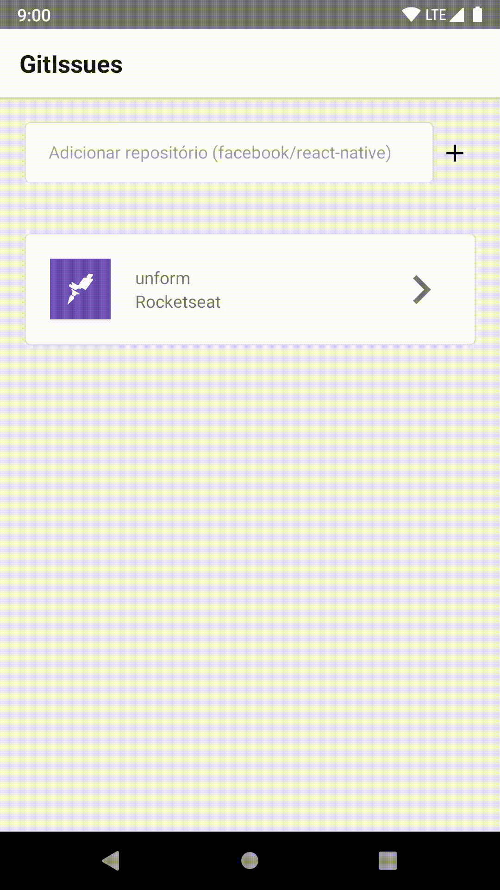

# GitIssues

Project in React Native that accesses the GitHub API allowing you to access repositories and view your Issues

# Installation

Clone repository

> git clone https://github.com/Trosdan/GitIssues.git

Download dependencies with yarn

> yarn

Run the project

> react-native run-android

or

> react-native run-ios
